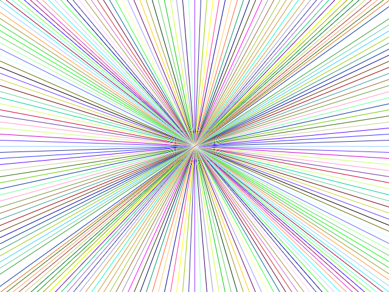

# Graphics

Generates graphics, like so:

> **NOTE:**
>
> Requires the `gfx` module:
>
>     require gfx
>

## General

### gfx.init

### gfx.set.size _width_ _height_

### gfx.eport.to.png _filename_A

### gfx.width

### gfx.height

## Colors

### gfx.stroke.color _color_

### gfx.fill.color _color_

### color.random

## Drawing

### gfx.clear

### gfx.line _x1_ _y1_ _x2_ _y2_

### gfx.rect.fill _x1_ _y1_ _x2_ _y2_
