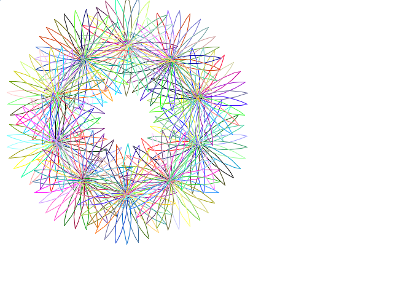

# Turtle

Generates turtle graphics, like so:



> **NOTE:**
>
> Requires the `turtle` module:
>
>     require turtle
>

Imports the following dictionaries:

* [math](./math.md)
* [gfx](./gfx.md)

## General

### turtle.init

Required before you use any turtle functionality. Expects `gfx.init` to already have been executed.

```text
gfx.init
turtle.init
```

## Movement and Position

### turtle.moveto _x_ _y_

### turtle.set.pos

### turtle.set.x

### turtle.x

### turtle.set.y

### turtle.y

### turtle.home

### turtle.forward _distance_ (FD)

### turtle.backward _distance_ (BK)

## Direction

### turtle.set.heading _heading_

### turtle.heading

### turtle.right _degrees_ (RT)

### turtle.left _degrees_ (LT)

## Pen

### turtle.set.pen.color (PC)

### turtle.pen.color

### turtle.pen.up (PU)

### turtle.pen.down (PD)

## Misc

### turtle.circle _size_

### turtle.square _size

### turtle.flag _size_
