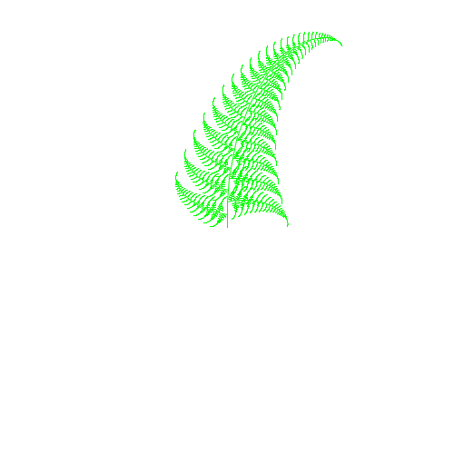

# Fern



```text
require turtle

gfx.init
gfx.set.size 500 500
turtle.init

pc "green"

to fern [ sz ] {
    # "fern program"
    # "adapted from http://infohost.nmt.edu/~blewis/html/fractaltrees.html"
    if (sz >= 5) [
        fd ( sz / 25 )    # "trunk"
        lt 80
        fern ( sz * 0.3 ) # "left branch"
        rt 82
        fd (sz / 25)
        rt 80
        fern ( sz * 0.3 ) # "right branch"
        lt 78
        fern ( sz * 0.9 ) # "spine"
        lt  2
        bk ( sz / 25 )
        lt  2
        bk ( sz / 25 )
    ]
    0
}

fern 350
```
