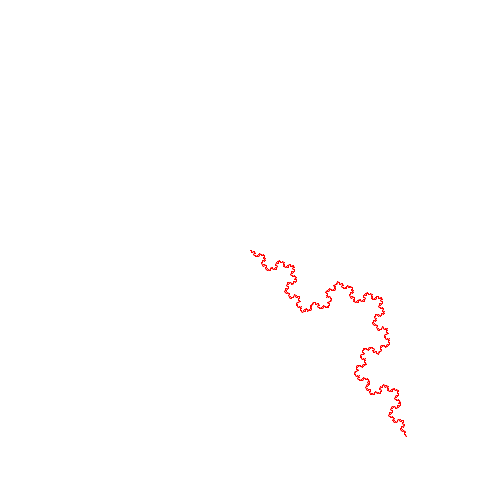

# Koch



```text
require turtle

gfx.init
gfx.set.size 500 500
turtle.init

pc "white"

to koch [ u ] {
    if ( u < 2 ) {
        fd 1
    } else {
        koch (u - 1)
        lt 60
        koch (u - 1)
        rt 120
        koch (u - 1)
        lt 60
        koch (u - 1)
    }
}

koch 6
```
