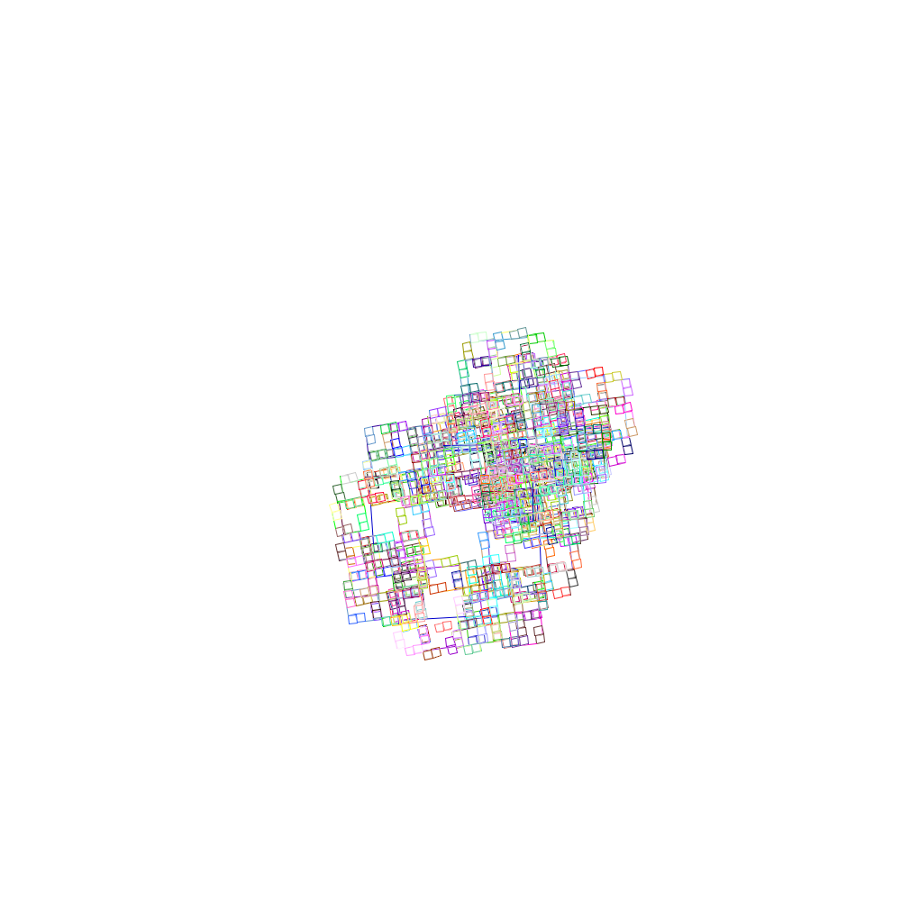

# Pattern



```text
require turtle

gfx.init
gfx.set.size 500 500
turtle.init

to pattern [ d ] {
    c = color.random
    if (d > 1) {
        dir = 89
        repeat 2 [
            repeat 5 [
                rt dir
                pc c
                fd (d * 6)
                if (d > 1) [
                    pattern ( d / 2 )
                ]
            ]
            dir = (dir * -1)
        ]
    }
}

pattern 12
```
