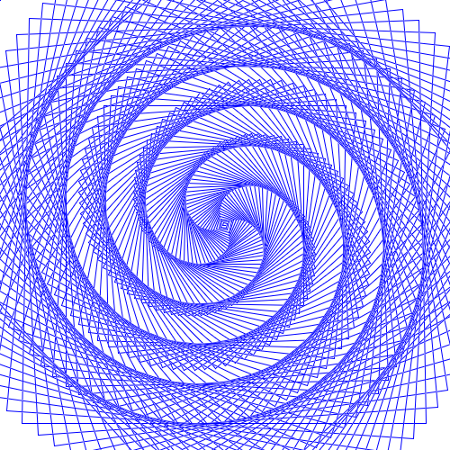

# Spiral



Generated by the following code:

```text
require turtle
gfx.init
gfx.set.size 500 500
turtle.init

to spiral [] {
    i = 0
    repeat 500 [
        rt 91
        fd i
        i = i + 1
    ]
}

pc "blue"
spiral
```
