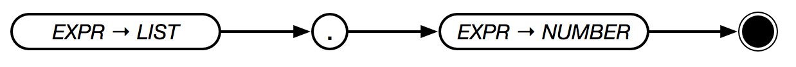

# `.`



Returns the `N`th item in `LIST` (zero based) or `STRING`. If `N` is negative, the `N`th item from the end of the list or string is returned.

if `N` is a list, `.` returns the items between the first value and the second in the list, inclusive.

```text
[1 2 3] . 0
→ 1

[1 2 3] . 2
→ 3

[1 2 3] . -1
→ 3

[1 2 3] . -3
→ 1

[1 2 3 4] . [ 0 2 ]
→ [ 1 2 3 ]

[1 2 3 4] . [ 0 -2 ]
→ [ 1 2 3 ]

```
