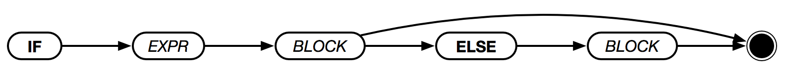

# `IF` [`ELSE`]



If `EXPR` evaluates to `1`, the `IF-BLOCK` is executed and returned. If `ELSE` is present and `EXPR` evaluted to `0`, the `ELSE-BLOCK` is executed and returned instead.

```text
IF (1 < 2) {
    "true"
}
> "true

IF (1 > 2) {
    "true!"
} ELSE {
    "false"
}
> "false"
```
