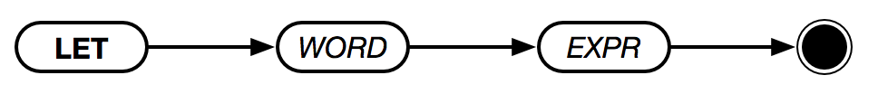

# LET



Assigns the result of `EXPR` to a new variable in the current scope named `WORD`. Equivalent to the assignment operator.

> **IMPORTANT**:
>
> `LET` can't modify variables outside of the current scope. It can only create and modify variables within the current scope.

```text
let a 5
let b a + 5
print b
→ 10
```

Alternatively:

```text
{
    a = 5
    b = a + 5
    print b
}
10
```

`LET` can also be used to extract values out of lists, like so:

```text
let [first middle last] ["John" "F" "Kennedy"]
let fullName last + ", " + first + " " + middle
print fullName
→ Kennedy, John F
```

Alternatively, using `=`:

```text
[first middle last] = ["John" "F" "Kennedy"]
fullName = last + ", " + first + " " + middle
print fullName
→ Kennedy, John F
```
