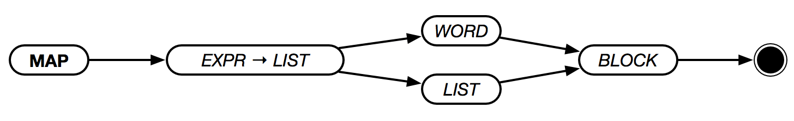

# `MAP`



Iterates over each item in `LIST`, executing `MAP-BLOCK` for each item. `ITEM-VAR` and `INDEX-VAR` can be used to indicate the variable names for the list item and the list index respectively.

```text
MAP [1 2 3 4] [ X IDX ] { X + IDX }
> [1 3 5 7]

MAP [1 2 3 4] [ X ] { X * 2 }
> [2 4 6 8]

MAP [1 2 3 4] X { X * 2 }
> [2 4 6 8]
```
