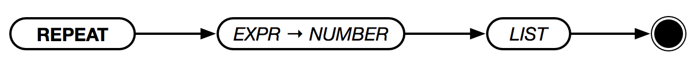

# `REPEAT` (Alias: `RPT`)



Repeats the items in `REPEAT-LIST` the number of times specified by `TIMES`. If `EXIT` or `EXITWITH` is used, the loop can be exited early.

Because `REPEAT-LIST` is not in `{...}`, no new scope is created and changes to variables can be persisted. This is useful for keeping track of how many times through the loop one has been.

```text
LET IDX 0
REPEAT 4 [
    LET IDX :IDX + 1
    PRINT :IDX
]
PRINT :IDX
> 1
> 2
> 3
> 4
> 4
```
