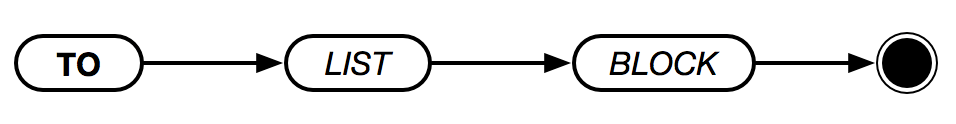

# `TO`



Creates a new word definition in the global namespace. The following limitations apply to definitions:

* Native words may not be redefined. Attempting to do so will result in a `Cannot overwrite native word implementation.` error.
* Once defined, words cannot be redefined. Attempting to do so will result in a `Can't redefine word` error.

Once a word is defined, it may be used like any other word in the standard dictionary. The last expression that evaluates to a value is the return result of the word.

For example, imagine the following definition:

```text
TO DOUBLE [ N ] {
    N * 2
}
```

Once defined, `DOUBLE` becomes a word we can use anywhere else in our program. For example,

```text
DOUBLE 5
> 10
```

## Defining Parameters

When defining a word, **ishish** expects you to define a list of parameters. You can have as many as you want–even zero–but you must always provide a list (even if empty).

When a word is invoked, **ispish** will then pass in the _arguments_ to the word to each parameter in order. For example:

```text
TO DIVIDE [ X Y ] {
    X / Y
}
DIVIDE 4 2             REM 2
DIVIDE 20 5            REM 4
```

In the above examples, the first argument to `DIVIDE` is assigned to the `X` parameter, and the second argument is assigned to the `Y` parameter. Had the values been assigned out-of-order the result would be incorrect.

## Additional Arguments

There are times when a fixed number of arguments is too inflexible. Consider a word that should double each argument. We can't specify a fixed number of parameters simply because we don't know how may arguments may be provided. We could use a list, but that would count as only one argument.

**ispish** provides a way around this. When invoking a word, two new variables are created in the word's scope: `_args` and `_rest`.

* `_args` is a list containing all the arguments passed to the word, _including_ any specified in the word's parameter list.
* `_rest` is a list containing all the remaining arguments passed to the word, _excluding_ any specified in the word's parameter list.

In order to invoke words with a variable number of arguments, one must wrap the word and arguments in parentheses. Otherwise, only the arguments that match to a word's argument are passed.

Here's an example that doubles all the arguments:

```text
TO DOUBLE [ ] {
    MAP _ARGS X { X * 2 }
}
(DOUBLE 1 2 3)
> [2, 4, 6]
```

Notice that we've wrapped `DOUBLE` and `1 2 3` in parentheses. If we had used `DOUBLE 1 2 3` on its own, the result would have been quite different:

```text
DOUBLE 1 2 3
> 3
```

What's actually going on becomes clearer if we put everything in a list:

```text
[DOUBLE 1 2 3]
> [ [], 1, 2, 3 ]

Notice that `DOUBLE` is actually being called with no arguments–this is because it wasn't invoked within a parenthetical group.

Using `_REST` is similar to using `_ARGS`, except parameters in the word's parameter list aren't included. Let's look at an example:

```text
TO ADD.EACH [ inc ] {
    MAP _REST X { X + INC }
}
(ADD.EACH 5 1 2 3)
> [6, 7, 8]
```

Again, we wrap `ADD.EACH` and the arguments in parentheses. If we didn't, the results would be incorrect. For example:

```text
[ADD.EACH 5 1 2 3]
> [ [], 1, 2, 3]
```

`ADD.EACH` did receive the first argument (`5`), but the other numbers weren't included because we didn't use parentheses.


