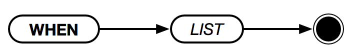

# `WHEN`



`WHEN` is useful when you need to test for multiple conditional expressions. The conditions don't have to be mutually exclusive, however execution _is_ stopped upon the first successfully matched condition.

```
LET A 10
LET B 20
WHEN [
    (:A < :B) "less"
    (:A > :B) "greater"
    "equal"
]
> "less"