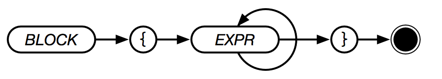

# Block



A block is a list of of other types that is executed whenever it is encountered. The last value handled is the return value of the block. A block also creates a new scope, so variables created within a block are not visible outside of the block.

```text
LET A 9
{
    LET A 5  # "A is now 5, but scoped to this block"
    :A * 2   # "A is now 10"
} # "A is 9 -- outside of the block"
```
