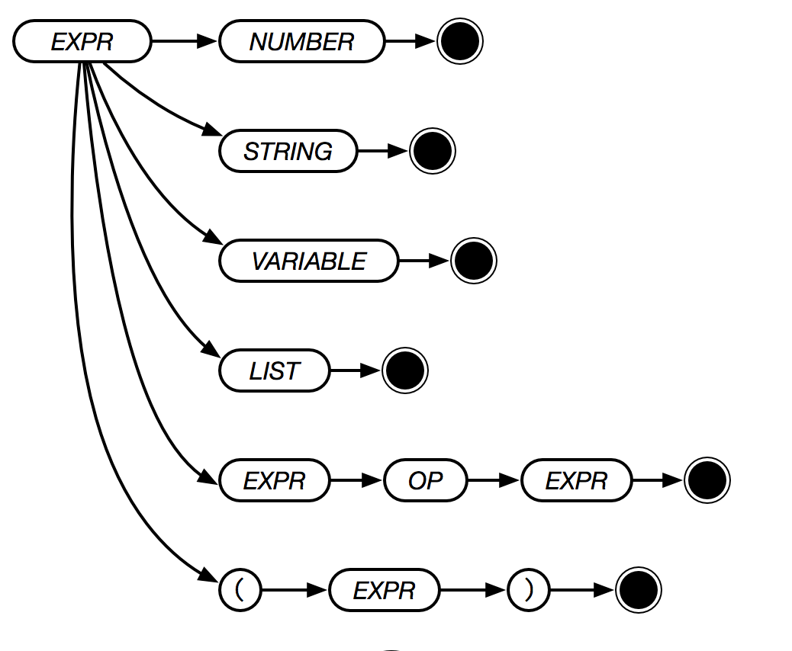

# Expression

An expression is typically a mathematical expression. For example "2 + 2" is an expression represented by the `+` word and two numbers. Expressions occur naturally in the course of writing a program, and the return result is the result of evaluating the expression.
