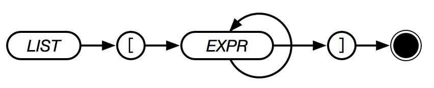

# List



A list represents a collection of items. Any type can be stored within a list. Lists typically act as arrays in other languages and can be indexed and manipulated.

```text
[]
[ 1 ]
[ 1 2 3 4 ]
[ "hello" "this" "is" "a" "list" ]
[ "lists" "are" "not" "required" "to" "have" "the" "same" "types" 1 2 3 4 ]
[ LISTS CAN ALSO CONTAIN WORDS ]
[ [ 1 2 3 4 ] [ 5 6 7 9 ] ]
```
