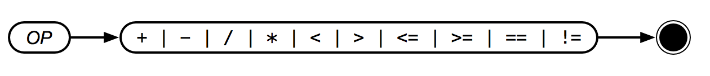

# Operator



Operator | Precedence | Meaning
:-------:|:----------:|:---------
`*`      | High       | Multiply
`/`      | High       | Divide
`+`      | Medium     | Add
`-`      | Medium     | Subtract

Comparison operators are also present:

Operator | Precedence | Meaning
:-------:|:----------:|:---------
`<`      | Low        | Less Than
`>`      | Low        | Greater Than
`<=`     | Low        | Less Than or Equal
`>=`     | Low        | Greater Than or Equal
`==`     | Low        | Equal
`!=`     | Low        | Not Equal

**ispish** requires that these words be used in **infix** notation—which is the normal mathematical form. For example:

```text
PRINT 2 + 2
> 4
PRINT 2 + 4 * 5
> 22
```

If you need to specify precedence, parentheses are allowed:

```text
PRINT (2 + 4) * 5
> 30
```

Conditional operators work the same way, but will return `1` if the condition is truthful and `0` if the condition is false. For example:

```text
PRINT 1 < 2
> 1
PRINT 1 == 2
> 0
```
