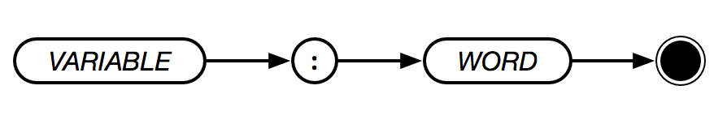

# Variable



**ispish** expects one to signal their intent to reference a variable by using the `:` (colon) sigil. Variables are scoped according to blocks.

> **NOTE**: Variable names are not case sensitive.

```text
:a
:variable
:thisIsAVariableName
:THISISAVARIABLENAME
```
