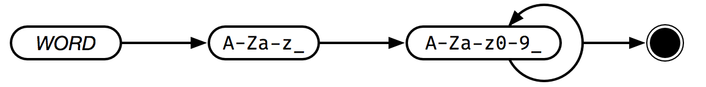

# Word



A **word** can represent a native command, a call to a function, or the name of a variable definition. A word does not necessarily map to the English definiton of "word" -- operators like `+` are also words.

> **NOTE**: Words are not case sensitive. It is convention to use UPPERCASE when writing words.

```text
+
LET
DOUBLE
A
```
